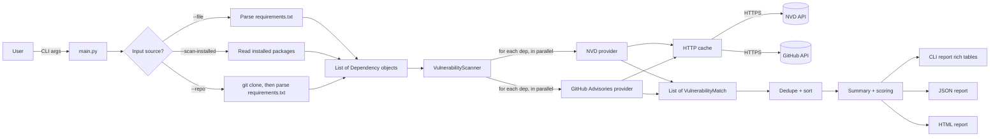
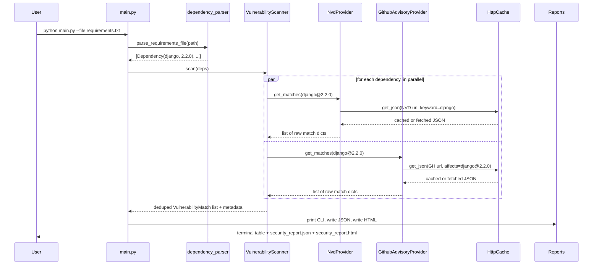
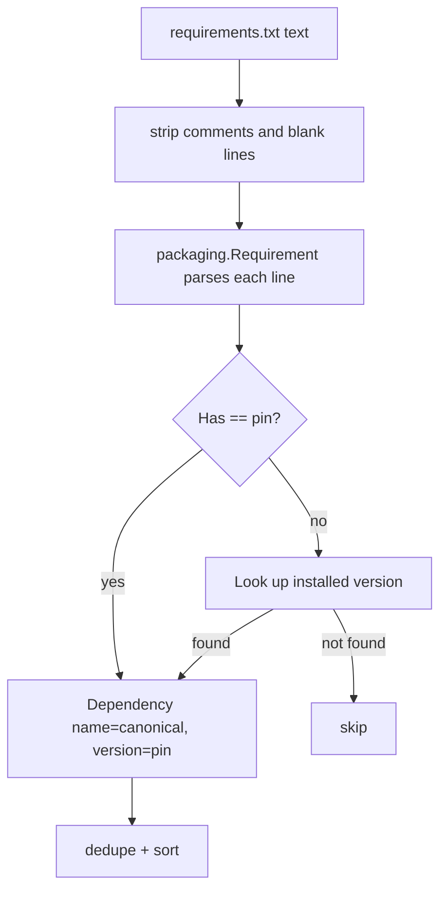
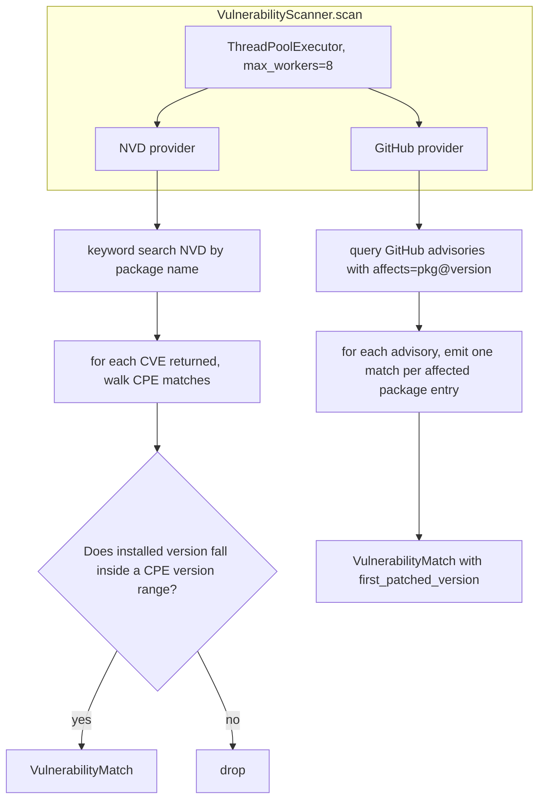
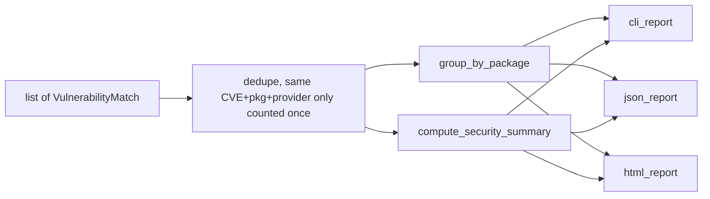
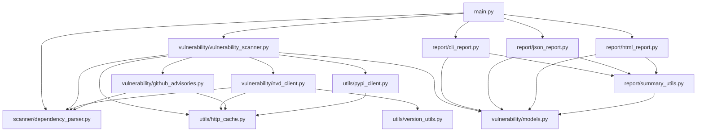

# VulnScan — Architecture, Analysis, and Improvement Plan

> Internal walkthrough for the VulnScan project (CMPE-279, Sec 01 — Software Security Technologies).
> Covers: first-principles explanation of the system, component diagrams, correctness issues found in the current code, and a prioritized improvement plan mapped to the class grading rubric.

---

## Table of Contents

1. [Problem statement in one sentence](#1-problem-statement-in-one-sentence)
2. [Vocabulary you need](#2-vocabulary-you-need)
3. [Whole system in one diagram](#3-whole-system-in-one-diagram)
4. [Folder-to-phase mapping](#4-folder-to-phase-mapping)
5. [What flows through the pipeline](#5-what-flows-through-the-pipeline)
6. [The `VulnerabilityMatch` data structure](#6-the-vulnerabilitymatch-data-structure)
7. [Zoom into each phase](#7-zoom-into-each-phase)
  - [Phase 1 — Input](#phase-1--input-from-text-to-dependency-objects)
    - [Phase 2 — Lookup](#phase-2--lookup-one-dep-in-many-matches-out)
    - [Phase 3 — Output](#phase-3--output-from-matches-to-reports)
8. [Module dependency graph](#8-module-dependency-graph)
9. [Weak spots mapped to the architecture](#9-weak-spots-mapped-to-the-architecture)
10. [Mental model in one line](#10-mental-model-in-one-line)
11. [Detailed correctness issues](#11-detailed-correctness-issues)
12. [Mapping the current state to the class rubric](#12-mapping-the-current-state-to-the-class-rubric)
13. [Prioritized improvement plan](#13-prioritized-improvement-plan)
14. [Report and presentation guidance](#14-report-and-presentation-guidance)
15. [Suggested division of labor](#15-suggested-division-of-labor)

---

## 1. Problem statement in one sentence

Every Python project imports third-party packages (Django, requests, PyJWT, …). Some versions of those packages have publicly known security bugs. VulnScan's job is:

> Given a list of packages and their versions → output a list of known security bugs that affect those exact versions, with severity and a suggested fix.

Everything else (caching, HTML, scoring, CLI flags) is infrastructure around that core idea.

---

## 2. Vocabulary you need

Five terms are enough to read the rest of this doc.


| Term           | Meaning in plain English                                                                                                   |
| -------------- | -------------------------------------------------------------------------------------------------------------------------- |
| **Dependency** | A single `name@version` pair, e.g. `django@2.2.0`.                                                                         |
| **Advisory**   | A published document that says "version range X of package Y has bug Z."                                                   |
| **CVE**        | A globally unique ID for a vulnerability, e.g. `CVE-2021-44228` (Log4Shell). Managed by MITRE / NVD.                       |
| **GHSA**       | GitHub's own ID for the same kind of thing, e.g. `GHSA-xxxx-xxxx-xxxx`. Often cross-references a CVE.                      |
| **CVSS score** | A number 0.0–10.0 that quantifies how bad a vulnerability is. `≥9.0` = critical, `≥7.0` = high, `≥4.0` = medium, else low. |


Two databases VulnScan queries:

- **NVD** (National Vulnerability Database, run by NIST) — the canonical US government database of CVEs.
  - API: `https://services.nvd.nist.gov/rest/json/cves/2.0`
- **GitHub Advisory Database** — GitHub's curated list, usually higher quality for open-source packages.
  - API: `https://api.github.com/advisories`

---

## 3. Whole system in one diagram

The whole tool is a three-phase pipeline: **Input → Lookup → Output**.




Every file in the repo belongs to exactly one of those three phases, or to shared plumbing.

---

## 4. Folder-to-phase mapping

```
vulnscan/
├── main.py                      ← orchestrator (the conductor)
│
├── scanner/                     ← PHASE 1: INPUT
│   └── dependency_parser.py       "turn a requirements file or
│                                   an environment into Dependency objects"
│
├── vulnerability/               ← PHASE 2: LOOKUP
│   ├── models.py                  data classes (VulnerabilityMatch)
│   ├── nvd_client.py              talks to NVD
│   ├── github_advisories.py       talks to GitHub
│   └── vulnerability_scanner.py   runs both providers in parallel
│
├── report/                      ← PHASE 3: OUTPUT
│   ├── summary_utils.py           scoring + grouping (shared)
│   ├── cli_report.py              terminal output
│   ├── json_report.py             machine-readable output
│   └── html_report.py             demo-ready webpage
│
└── utils/                       ← SHARED PLUMBING
    ├── http_cache.py              caches API responses to disk
    ├── pypi_client.py             asks PyPI for latest version
    └── version_utils.py           "is 2.2.0 inside the range ≥2.0, <3.0 ?"
```

If you memorize only one thing from this doc, memorize this tree.

---

## 5. What flows through the pipeline

Trace a single dependency, `django==2.2.0`, all the way through.




Key insight: the same dependency gets asked about twice, once per provider. Each provider returns a list of `VulnerabilityMatch` objects. The scanner merges and deduplicates them.

---

## 6. The `VulnerabilityMatch` data structure

This is the single data structure that flows from Phase 2 into Phase 3. Defined in `vulnerability/models.py`:

```python
@dataclass
class VulnerabilityMatch:
    provider: str
    package_name: str
    current_version: str

    # Advisory identifiers
    cve_id: str | None
    ghsa_id: str | None

    # Vulnerability details
    vulnerable_version_range: str | None
    severity: Severity | None
    cvss_score: float | None
    description: str | None
    fix_recommendation: str | None
    references: list[str]

    # Optional: version that is known to contain a fix for this advisory
    patched_version: str | None = None
```

Think of it as **one row of the final report**. Every table you see in CLI, JSON, or HTML is a list of these.

---

## 7. Zoom into each phase

### Phase 1 — Input: from text to `Dependency` objects




Relevant code: `parse_requirements_file` in `scanner/dependency_parser.py`.
Important rule: the parser **only keeps dependencies where it can determine an exact version**, because vulnerability matching without a concrete version is meaningless.

### Phase 2 — Lookup: one dep in, many matches out




Why two very different shapes? Because the two APIs speak different languages:

- **NVD** thinks in **CPEs** (Common Platform Enumeration strings like `cpe:2.3:a:djangoproject:django:2.2.0:*:*:...`) and version ranges. You have to match the CPE product name to your package, then check bounds like `versionStartIncluding`, `versionEndExcluding`, etc. That's exactly what `_walk_cpe_matches` + `_installed_in_cpe_range` in `nvd_client.py` do.
- **GitHub** thinks in **ecosystem + package name + version**. You literally ask "what advisories affect pip package `django@2.2.0`?" and it does the version-range math for you.

NVD is more painful but more comprehensive. GitHub is cleaner but narrower. Using both = belt + suspenders.

### Phase 3 — Output: from matches to reports




Two helpers do the heavy lifting, both in `report/summary_utils.py`:

- `group_by_package(matches)` — takes the flat list and buckets it by package, then tries to infer a single **safe version** per package (the max of all `patched_version` fields). Result: one card per vulnerable package.
- `compute_security_summary(matches, dependency_count)` — turns severity counts into a 0–100 score. Formula is:
  ```
  risk_points = 20·#critical + 10·#high + 5·#medium + 2·#low
  score       = 100 − round(min(risk_points, 100) / 100 · 90)
  # floor at 10, ceiling at 100
  ```
  So one critical = −18 points. Five criticals or more = floored at 10. This is a design choice, not a standard — defend it explicitly in the IEEE report.

---

## 8. Module dependency graph

Static view — who imports whom. Useful when you change one file and want to know what else could break.




Reading tips:

- `models.py` is a **leaf** — nothing it depends on, lots depends on it. Good sign; data types should be stable.
- `utils/http_cache.py` is also a leaf and is the single chokepoint for all outbound HTTP. Architecturally clean.
- `report/summary_utils.py` is shared by all three reporters. If you change the score formula, all three outputs update automatically.
- `scanner/dependency_parser.py` exports `Dependency`, which is imported by Phase 2 code. That's a one-way dependency: the scanner doesn't know anything about vulnerabilities. Good separation.

---

## 9. Weak spots mapped to the architecture

```mermaid
flowchart TB
    main[main.py]
    dp[scanner/dependency_parser.py]
    nvd[vulnerability/nvd_client.py]:::bad
    gh[vulnerability/github_advisories.py]:::ok
    vs[vulnerability/vulnerability_scanner.py]:::minor
    hr[report/html_report.py]:::minor
    hc[utils/http_cache.py]:::minor

    classDef bad fill:#5a1a1a,stroke:#ef4444,color:#fff
    classDef minor fill:#3a2e1a,stroke:#eab308,color:#fff
    classDef ok fill:#173a1a,stroke:#22c55e,color:#fff
```




- **Red (`nvd_client.py`)**: parsing the wrong schema. Highest-impact fix because it silently disables half the data source.
- **Yellow**:
  - `vulnerability_scanner.py` sorts severities alphabetically (cosmetic but defendable as a bug).
  - `html_report.py` doesn't escape HTML and uses deprecated `datetime.utcnow()`.
  - `http_cache.py` has no TTL — fine for a demo, but document as an explicit trade-off.
- **Green (`github_advisories.py`)**: this one actually works end-to-end and is where most real findings come from today.

The "no tests anywhere" issue is orthogonal to this diagram — it's a cross-cutting concern, not a specific module.

---

## 10. Mental model in one line

If you need a one-liner version of the whole design for a presentation:

> A three-stage pipeline — parse dependencies, ask two vulnerability databases in parallel, and render the merged results three ways — glued together by a small on-disk HTTP cache.

Every file is one of: an input parser, a database client, an output renderer, or shared plumbing.

---

## 11. Detailed correctness issues

These matter because if the NVD path is silently broken, "Results" in the report becomes hard to defend.

### 11.A — NVD JSON parsing targets the 1.x schema, but the URL is the 2.0 endpoint

**Severity: critical.**

In `vulnerability/nvd_client.py` the code reads fields that don't exist in NVD 2.0:

```python
def _extract_cve_description(cve_item: dict[str, Any]) -> str | None:
    try:
        for d in cve_item["cve"]["description"]["description_data"]:
            if d.get("lang") == "en":
                return d.get("value")
```

NVD 2.0 actually returns:

- `cve.descriptions` (plural, direct list) — not `cve.description.description_data`
- `cve.id` — not `cve.CVE_data_meta.ID`
- `cve.references` as a direct list — not `cve.references.reference_data`
- `cve.metrics.cvssMetricV31[*].cvssData.baseScore` — not `impact.baseMetricV3.cvssV3.baseScore`
- CPE matches under `cve.configurations[*].nodes[*].cpeMatch[*].criteria` — not `cpe23Uri`

Net effect: `_extract_cve_id`, `_extract_cve_description`, `_extract_cvss`, `_extract_severity`, `_extract_references`, `_walk_cpe_matches`, `_parse_cpe_product_version`, and `_installed_in_cpe_range` are all reading 1.x shapes against 2.0 responses. In practice the NVD provider returns almost nothing, and the demo is carried entirely by GitHub Advisories.

Fix: either rewrite the extractors against the 2.0 schema, or — better — add `osv.dev` as the primary backend (see §13, Tier 2 #6).

### 11.B — `datetime.utcnow()` is deprecated

Python 3.12+ emits a `DeprecationWarning`. In `report/html_report.py`:

```python
generated_at = datetime.utcnow().isoformat() + "Z"
```

Use `datetime.now(timezone.utc)` — already done correctly in `report/json_report.py`.

### 11.C — HTML injection / broken layout risk

`report/html_report.py` interpolates `v.description`, `g.package_name`, `ident`, etc. straight into HTML. Advisory descriptions regularly contain `<`, `>`, `&`. At minimum wrap everything with `html.escape(...)`. This is also a good security-relevance talking point for the report itself (ironic if a security tool has an HTML-injection sink).

### 11.D — `pkg_resources` is deprecated

Emits a warning on newer `setuptools` versions:

```python
try:
    import pkg_resources
    for dist in pkg_resources.working_set:
```

Drop the `pkg_resources` branch and rely on `importlib.metadata` — already the fallback path.

### 11.E — Sort order for matches is right by accident

```python
out.sort(key=lambda x: (x.severity or "unknown", x.package_name), reverse=False)
```

Alphabetical on the severity string produces: `critical < high < low < medium < unknown`. That puts criticals first but `low` precedes `medium`. Use an explicit ordinal map, e.g.:

```python
SEV_ORDER = {"critical": 0, "high": 1, "medium": 2, "low": 3, "unknown": 4}
out.sort(key=lambda x: (SEV_ORDER.get(x.severity or "unknown", 4), x.package_name))
```

Trivial fix and easy to defend in the report.

### 11.F — Exit code is always `0` unless a file is missing

Add a `--fail-on {critical,high,medium,low}` flag that returns `1` when any finding is at or above the threshold. This is how `pip-audit` and `safety` both behave, and it's required for honest CI integration.

### 11.G — `--repo` only reads the root `requirements.txt`

No `pyproject.toml`, no `poetry.lock`, no `Pipfile.lock`, no nested directories. Real functional gap if a grader runs the tool on an arbitrary modern Python repo.

### 11.H — Keyword-based NVD search is noisy

For `requests`, the keyword matches thousands of unrelated CVEs. The CPE product-name check narrows it down, but the tool is still pulling 20 results × up to N pages × many packages worth of JSON for weak signal. Worth documenting as a limitation, and part of why OSV / GitHub are better primary sources.

### 11.I — `HttpCache` entries never expire

Silently returns cached JSON forever. The docstring even says "intentionally avoids complex invalidation." Fine for a demo, but the report should note this as an explicit design trade-off so a grader does not flag stale-data risk.

### 11.J — `pipdeptree_direct_dependencies()` returns everything, not just direct deps

The name lies. `--json-tree` gives you a nested tree; the current code flattens only the top-level nodes but never traverses children, and does not actually filter to "direct" dependencies of the root project.

### 11.K — Duplicate logging handler risk

`main.py` pushes a `StreamHandler` into `handlers` and also lets `basicConfig` potentially attach its own. In practice it works, but it is easy to get double-printed log lines. Minor.

---

## 12. Mapping the current state to the class rubric

Evaluation criteria from the syllabus: **Problem Importance, Solution Novelty, Technical Quality, Complexity and Effort, Creativity, Presentation Quality**.


| Criterion             | Current state                                                                        | What would lift the score                                                                                                                               |
| --------------------- | ------------------------------------------------------------------------------------ | ------------------------------------------------------------------------------------------------------------------------------------------------------- |
| Problem Importance    | Strong. OWASP A06:2021 (Vulnerable and Outdated Components) covers this directly.    | Keep as-is; cite OWASP and real incidents (Log4Shell, Equifax / Apache Struts).                                                                         |
| Solution Novelty      | Weak. `pip-audit`, `safety`, `Dependabot`, `Snyk`, `OSV-Scanner`, `Trivy` all exist. | Articulate a clear differentiator: multi-source cross-referencing, composite security score, SBOM export, CI-ready exit codes, polished HTML dashboard. |
| Technical Quality     | Decent architecture. NVD bug + missing tests + HTML escaping visible on code review. | Fix the Tier-1 items in §13.                                                                                                                            |
| Complexity and Effort | Moderate.                                                                            | Tests + benchmarks + SBOM + CI Action add visible evidence of effort.                                                                                   |
| Creativity            | Neutral.                                                                             | Lean into scoring + fix-impact grouping; add diff-style reporting vs a previous scan.                                                                   |
| Presentation Quality  | Depends on the report.                                                               | See §14.                                                                                                                                                |


---

## 13. Prioritized improvement plan

Items at the top give the biggest grading-rubric payoff per hour of work.

### Tier 1 — fixes the project genuinely should ship

1. **Fix NVD 2.0 parsing** (or switch primary source to `osv.dev`). Clear talking points for the report: CPE vs PURL, why OSV aggregates NVD + GHSA + others.
2. **HTML-escape all interpolated fields** in `html_report.py`. Tiny change; defensible in the "secure coding" section.
3. **Replace `pkg_resources`** with `importlib.metadata` only; remove the deprecation warning.
4. **Exit codes for CI**: `--fail-on high` semantics.
5. **Pytest tests**. Minimum useful set:
  - `tests/test_version_utils.py` — `version_in_range` corner cases (inclusive / exclusive, missing bounds).
  - `tests/test_dependency_parser.py` — `==`, `===`, nested `-r`, inline comments, `--extra-index-url` lines ignored.
  - `tests/test_summary_utils.py` — `compute_security_summary` weightings and `extract_vulnerable_range` regex cases.
  - `tests/test_github_advisories.py` — feed a canned advisories JSON from `tests/fixtures/` and assert `VulnerabilityMatch` fields.
  - `tests/test_nvd_client.py` — same pattern with a canned NVD 2.0 payload. This is what will expose the schema bug in §11.A if it has not yet been fixed.
  - `tests/test_cli.py` — invoke `main(["--file", ".../sample_requirements.txt", "--disable-nvd", "--disable-github-advisories"])` and assert exit code `0` + output files created.

### Tier 2 — high-leverage additions for a stronger report

1. **Add OSV.dev as a third provider** — `POST https://api.osv.dev/v1/query` with `{"package":{"name":..., "ecosystem":"PyPI"},"version":...}`. Clean JSON, strict version ranges, cross-references NVD + GHSA internally. Easy to present as "multi-source triangulation" for novelty.
2. **Broader manifest parsing**: `pyproject.toml` (PEP 621 + Poetry), `Pipfile.lock`, `poetry.lock`. Lift the version-reading logic into per-format modules under `scanner/`.
3. **SBOM output** — CycloneDX JSON or SPDX. Adds novelty and ties into industry standards you can cite. Roughly one function, a few dozen lines.
4. **GitHub Action** — an `action.yml` + small Dockerfile or composite action that runs the tool on PRs and fails on high severity. Turns "Future Improvements" into a live demo.
5. **Empirical evaluation**: run against a benchmark set of `requirements.txt` files (a handful of known-vulnerable historic versions of real projects) and compute agreement / precision / recall vs `pip-audit`. Directly upgrades the Results section from screenshots to a numbers table.

### Tier 3 — polish

1. Explicit severity ordinal sort (§11.E).
2. HTTP cache TTL — timestamp entries (already stored as `created_at`), honor a `--cache-ttl` flag.
3. Retry / 429 handling with exponential backoff for NVD (they rate-limit aggressively without a key).
4. HTML report UX: client-side sort / filter by severity and search by package name. One inline `<script>` + a few event handlers.
5. Type-check pass (`pyright --warn`), since `pyproject.toml` already sets `typeCheckingMode = "basic"`.
6. Input validation on `--repo` — reject anything that is not a recognized scheme (`https://`, `git@`, or existing local path).

---

## 14. Report and presentation guidance

The course explicitly **prohibits LLM-generated report text** and uses Turnitin. This section gives structure and evidence only — the words have to be yours.

- **Abstract + keywords**: `software composition analysis`, `CPE/PURL matching`, `CVSS`, `NVD`, `GHSA`, `OSV`.
- **Introduction**: motivate with OWASP A06:2021 (Vulnerable and Outdated Components) and real incidents (Log4Shell, Equifax / Apache Struts). Both are fair academic citations and tie the project to real-world impact.
- **Related work**: `pip-audit`, `safety`, `Snyk`, `Dependabot`, `OSV-Scanner`, `Trivy`. Spell out what each does and where VulnScan sits. This is where novelty gets defended.
- **Architecture section**: reuse the diagrams in §3, §5, §8 of this document.
- **Technical details**: CPE 2.3 vs PURL matching, PEP 440 version ordering, NVD pagination + rate limits, threaded concurrency, HTTP caching design, schema differences between NVD 1.1 and 2.0. The more design decisions you explain, the higher the Technical Quality and Complexity scores.
- **Results**: the empirical evaluation from Tier 2 #10. Include:
  - a table of findings vs `pip-audit` on the same `real_project_requirements.txt`
  - false-positive / false-negative discussion
  - timing / cache hit rate
  - screenshots of CLI + HTML output
- **Conclusions**: no "Future Work" section — the rubric explicitly forbids it. Fold roadmap items into implementation if possible, or drop them.
- **References**: IEEE style. Minimum citations: NVD, CVSS v3.1 spec, CPE 2.3 spec, OWASP Top 10, PEP 440, OSV schema, GHSA docs.

---

## 15. Suggested division of labor

Matches the "each member leads a major section" constraint.

- **Haroon**
  - Implementation: Tier 1 #1 (NVD 2.0 / OSV fix) + Tier 1 #5 (pytest suite).
  - Report lead: **Implementation and Providers** section.
- **Faiq**
  - Implementation: Tier 1 #4 (exit codes) + Tier 2 #9 (GitHub Action) + Tier 3 #14 (HTML UX).
  - Report lead: **System Design / Architecture** section.
- **Muqtadir**
  - Implementation: Tier 2 #6 (OSV provider) + Tier 2 #8 (SBOM) + Tier 2 #10 (empirical evaluation).
  - Report lead: **Results and Evaluation** section.

---

*Document maintained under `documentation/`. Update when the architecture changes.*